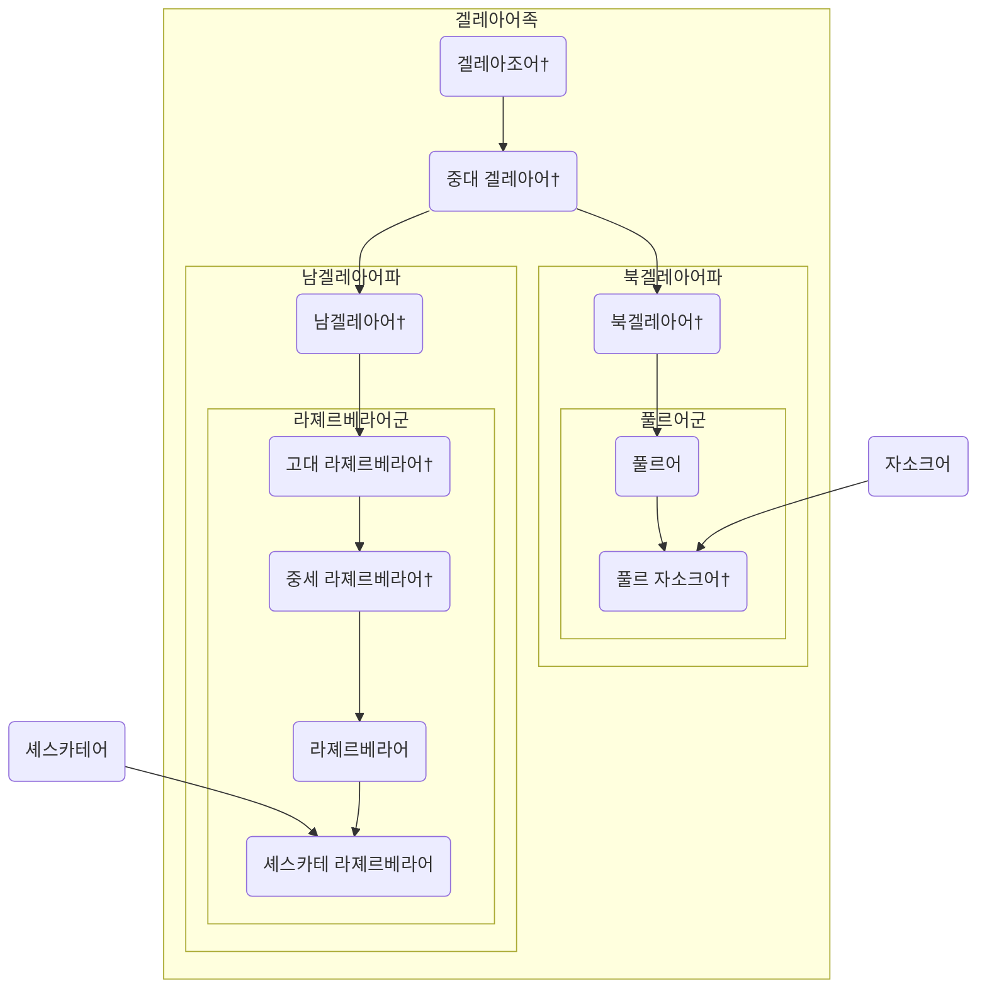

```mermaid
graph TD
  sches("셰스카테어") --> sl

  subgraph 겔레아어족
    pg("겔레아조어†") --> mg("중대 겔레아어†")
    mg --> ng
    mg --> sg
    
    subgraph 북겔레아어파
      ng("북겔레아어†") --> pulr
      
      subgraph 풀르어군
        pulr(풀르어) --> pz("풀르 자소크어†")
      end
    end
    
    subgraph 남겔레아어파
      sg("남겔레아어†") --> ol
      
      subgraph 라졔르베라어군
        ol("고대 라졔르베라어†") --> ml("중세 라졔르베라어†") --> lazhon(라졔르베라어) --> sl(셰스카테 라졔르베라어)
      end
    end
  end
  
  zasok("자소크어") --> pz
```
